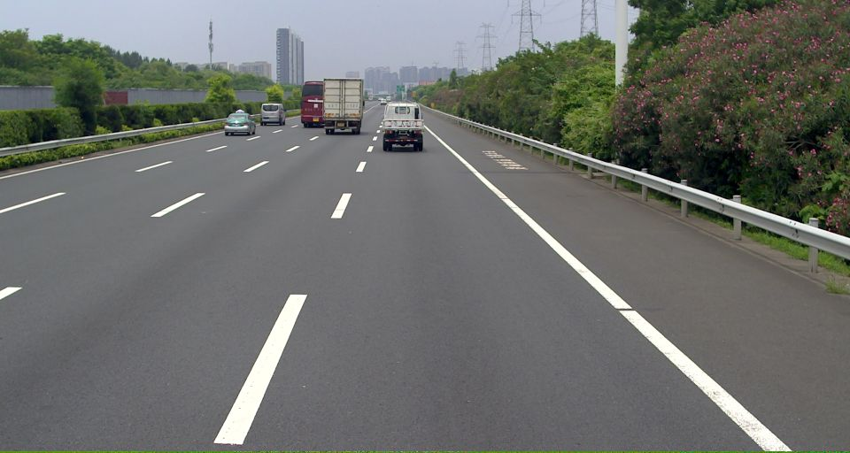
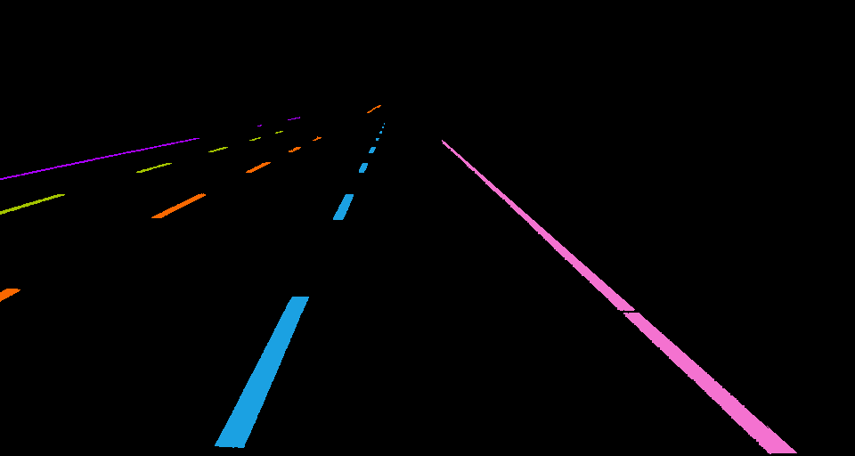
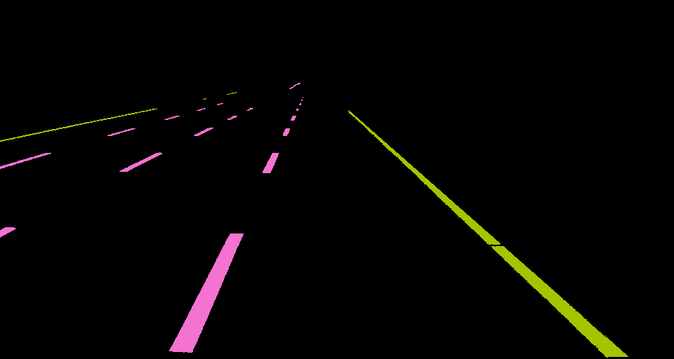
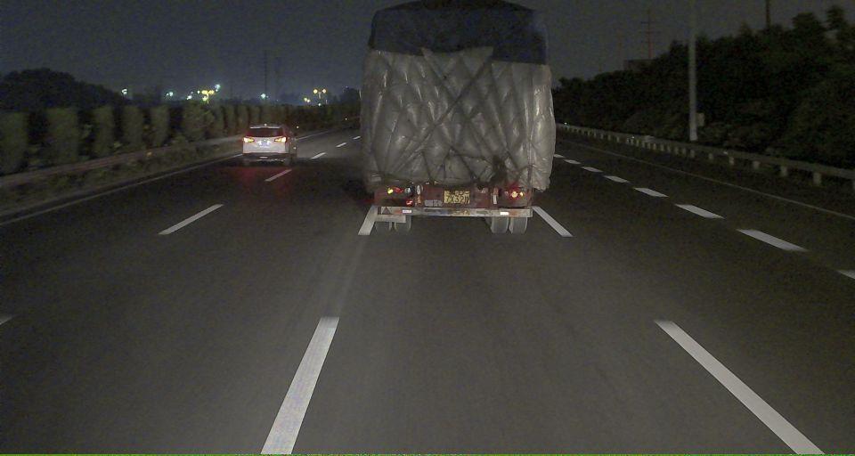
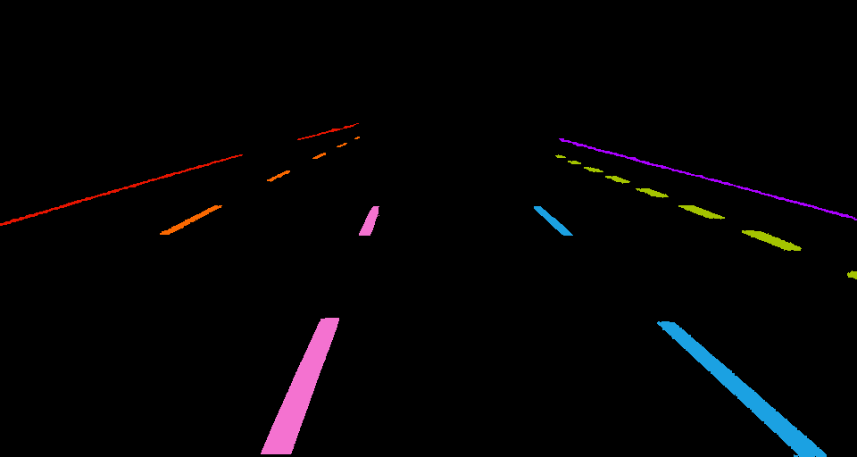
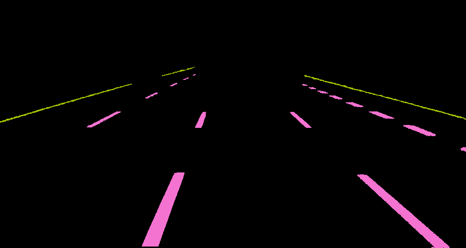
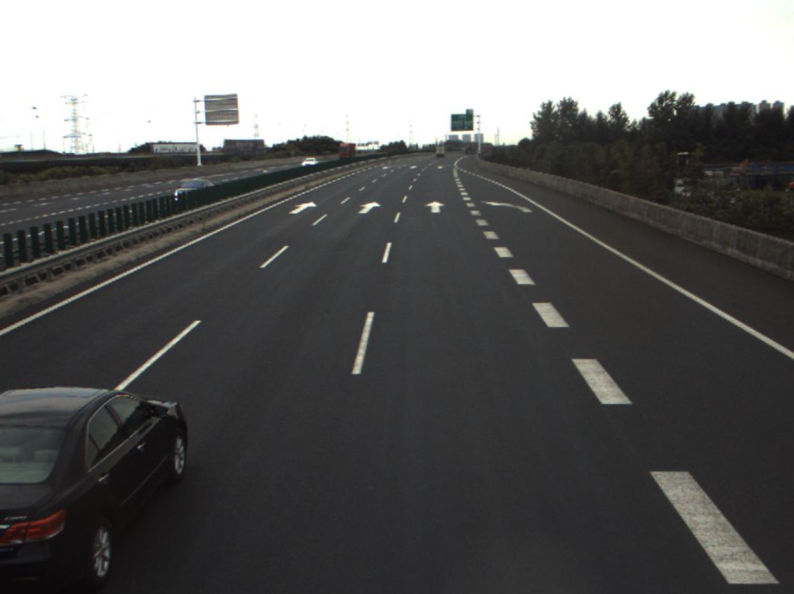
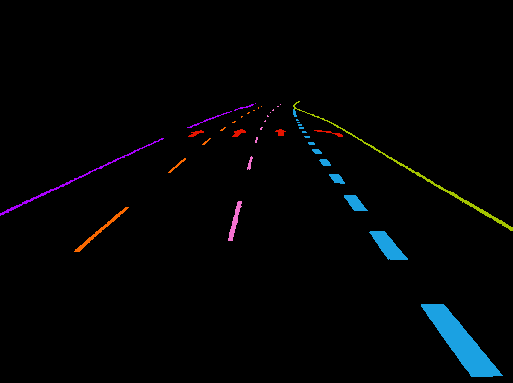
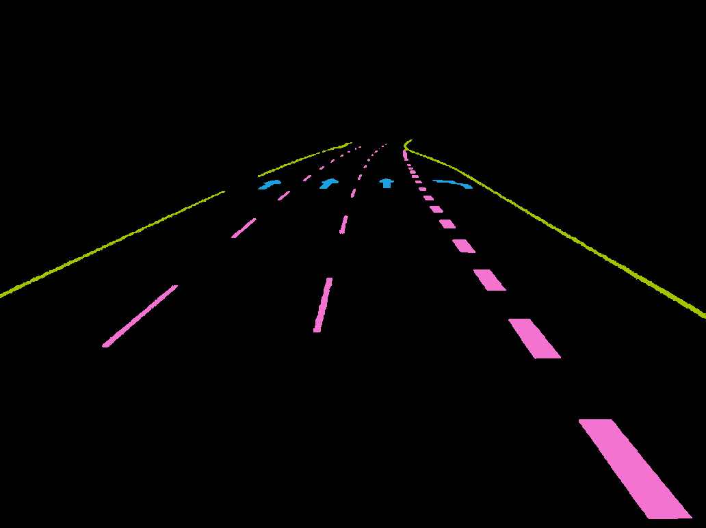
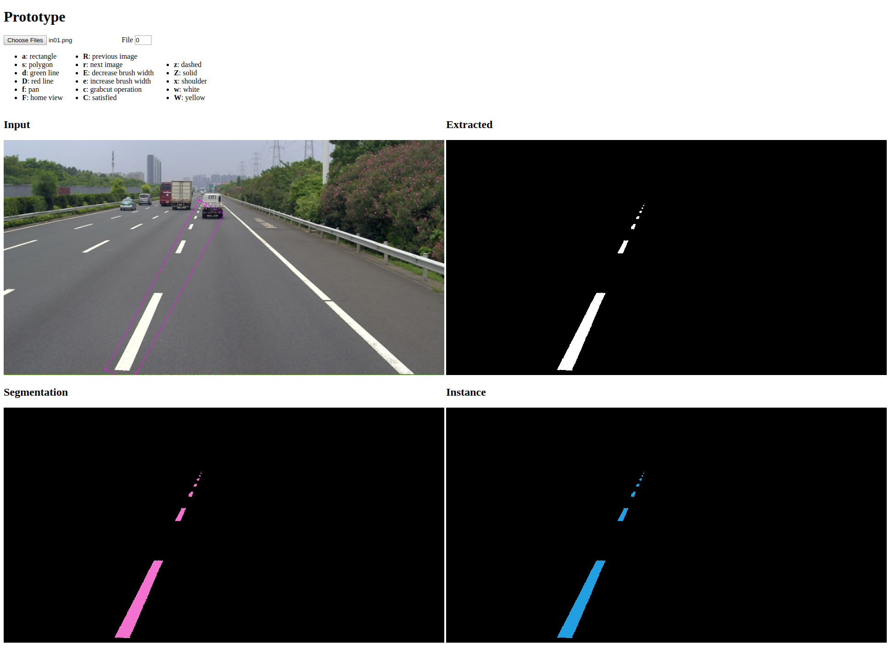

# Semi-Automatic Tool for Labeling Lane Markings
This is a prototypical version of a lane marking labeling tool developed for autonomous truck-drucking company PlusAI summer of 2019 as an internship project. The aim is to devise a fast and efficient way to extract out lane markings from road surface images collected on data runs by trucks in the fleet. Prior to this kind of tool, the company used a very simple point-by-point line segment method for lane annotation.

## Benefits and Optimzations
There are many benefits to this new tool:
1. Training data captures more semantic information than before after upgrading from a JSON document with point locations to mask images that contain labels for every pixel location in the image (i.e. a transition from coarse-grain to fine-grain annotations). Unfortunately, this bloats the amount of data that needs to be stored for each annotated image (2 8-bit 1-channel mask images for every RGB original image).
2. Instead of only being able to label lane lines, annotators can also very easily label arbitrary lane markings like zebra lines, merge arrows, and bike paths to further enhance the capabilities of our lane detection models.
3. The tool only requires an average of 4 clicks (to define a rotated rectangle) per lane line whereas the previous lane labeling tool requires an average of 7 clicks, which dramatically increases annotator productivity.

The core functionality of this tool relies on OpenCV.js's grabcut function, which performs an automatic foreground extraction operation given an image and a rectangle (for the initial extraction) or an image and a mask (for edits to the initial extraction result). However, this tool also implements a variety of optimizations that make the overall extraction results better and user experience more natural.

With regards to optimzations that deal with grabcut:
1. Because lane markings are usually brightly colored (yellow or white) and overlayed on a dark background (road surfaces are usually black or dark grey), it's not necessary to give the entire image as an input to grabcut. Instead, only a small ROI around the lane marking is necessary for an extraction result. This dramatically decreases the response time of the algorithm (around a hundred-fold) and actually increases the quality of the extraction result (because it declutters the colorspace with which grabcut is working with, so it's easier to tell foreground from background).
2. Lane lines are usually not horizontal or vertical, so it's inconvenient to only be able to draw upright boxes. So, this tool allows users to input points that define a rotated rectangle, automatically rotates the input image under the hood, calls grabcut on the rotated rectangle (actually, from bullet point 1, a small ROI of the rotated image), rerotates the extracted pixel locations, plots them on an empty mask, and returns the end result.

And improvements that deal with the user experience:
1. There is a cache that stores OpenCV matrices that represent the current working image and the most up-to-date segmentation and annotation results so that when the annotator is flipping through the images, there is virtually no delay for the browser to render the workspace for new images.
2. Sensical keyboard shortcuts (designed in a VIM-like fashion where the key codes don't actually give any indication of the function but related functions have hotkeys that are close together) that dramatically improve annotation efficiency and give the tool a sort of "coder-coolness."
3. Being able to display a beautiful colored rendering of the instance and segmentation results despite only actually saving an memory-efficient 1-channel version of the masks.
4. Allowing the user to change the brush size of their correction lines for smaller/larger corrections.

## Example Usage
In the below image strips, the first image is the original image given as input to the annotation tool. The second image is the annotated instance mask, which contains different colored pixels for different lanes (lane 1, lane 2, lane 3, etc.). The third image is the annotated segmentation mask, which contains different color pxiels for different semantic lane types (solid white lane, dashed yellow lane, etc.).

  
  
  

  
  
  

  
  
  

## User Interface
Here is a look at the actual user interface (and an example user input) actually used to create the above annotation samples. It's pretty bare bones in terms of visual elements and database integration—it doesn't actually allow users to pull in images from a remote server yet, which our current tool allows—but this is just the prototype proof of concept.

## Links
Here is a link to the presentation given about this tool I gave at the end of my internship: <a href="https://docs.google.com/presentation/d/13iTJtY_Zjhk1802EN6o4XwRwZfZt4w2V3w9gy2Yfs1U/edit?usp=sharing">Google Presentation</a>.
